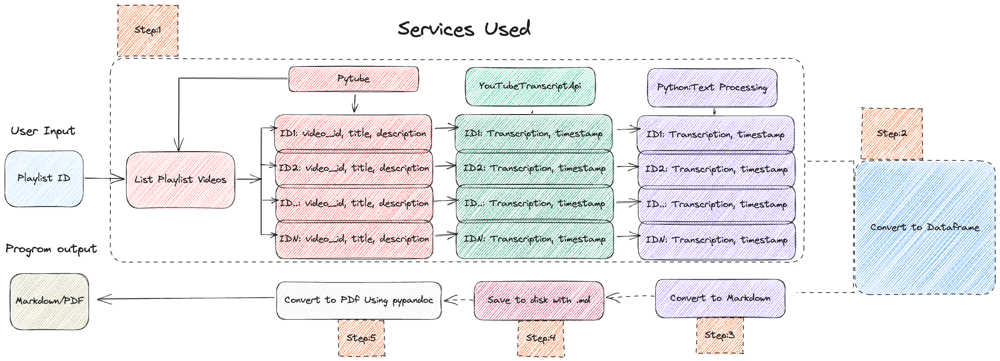

# YouTube Transcript to Readable PDF Pipeline

## Overview
This project aims to convert YouTube transcripts into readable PDF documents with time stamps. The purpose is to provide a convenient way for knowledge seekers to follow along and absorb valuable insights shared by Y-combinator, a content creator known for their exceptional expertise and captivating delivery.

## Motivation
Y-combinator's YouTube content is invaluable, and their expertise has made it a gem for individuals seeking knowledge. However, consuming video content can sometimes be challenging, especially when referring back to specific points of interest. By converting the transcripts into readable PDFs with time stamps, this project aims to enhance the learning experience and make it easier for users to navigate and reference information.

## Features
1. YouTube Video Information Extraction: The pipeline begins by extracting the video information from Y-combinator's YouTube videos. This process involves leveraging [Pytube](https://pytube.io/en/latest/) to obtain the video information (video_id, title, description) programmatically.

2. YouTube Transcript Extraction: The pipeline then extracts the transcripts from Y-combinator's YouTube videos. This process involves leveraging [Youtube-Transcript-Api](https://pypi.org/project/youtube-transcript-api/) to obtain the video transcriptions along with timestamps (transcription, timestamp) programmatically.

3. Text Preprocessing: The extracted transcripts undergo preprocessing to remove unnecessary noisy elements that may be present in the raw transcript data.

4. Time Stamp Integration: The pipeline integrates the time stamps within the PDF document to allow users to easily refer back to specific moments in the video. In addition, it merges chapters as Subheading and a reference to that heading. Users can simply click on a time stamp, and the corresponding video segment will be automatically played.
   
5. Markdown Generation: The preprocessed transcript is then formatted into a readable markdown document. Each line of text is accompanied by a corresponding time stamp, which indicates the video timestamp at which the content was spoken.

6. PDF Generation: The preprocessed transcript is then formatted into a readable PDF document. With the help of [Pypandoc](https://pypi.org/project/pypandoc/)

## Contributing
Contributions to this project are welcome. If you have any suggestions, bug reports, or feature requests, please open an issue on the GitHub repository.

## License
This project is licensed under the [MIT License](LICENSE).

## Acknowledgments
- Y-combinator for creating exceptional content and inspiring this project.

Enjoy converting YouTube transcripts with this pipeline to readable PDFs with time-stamps and delve deeper into the wealth of knowledge shared by HUMANITY!